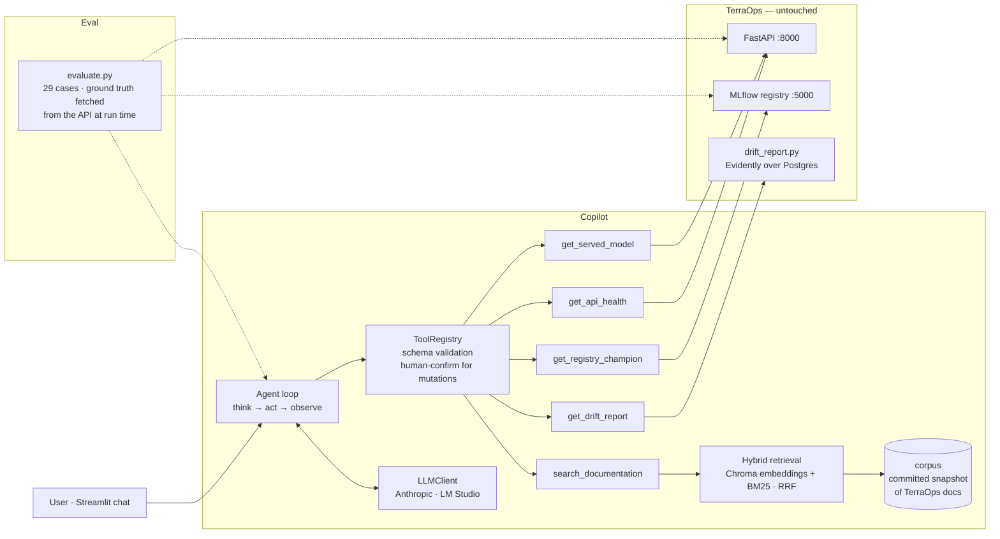

# TerraOps Copilot

**An LLM agent that operates an MLOps platform in natural language — and a harness that
measures whether it tells the truth.**

> *"Y a-t-il de la dérive cette semaine ?"* → the agent picks the drift tool, runs the real
> Evidently report against Postgres, and answers *"non concluant : 6 lignes sur 200 requises"*
> instead of *"no drift"*.
> *"C'est quoi la dérive ?"* → it searches the project documentation and answers with a
> citation. Nobody told it which was which.

<!--  — generated by scripts/record_demo.py once a provider is configured -->

## The problem

[TerraOps](https://github.com/D-Arslan/terraops) is a complete MLOps platform around a
EuroSAT land-use classifier: DVC pipeline, MLflow registry with a promotion gate, FastAPI
serving, Prometheus, Evidently drift monitoring, a continuous-training trigger. Operating it
means knowing seven endpoints, a registry, a CLI and 700 lines of design notes.

The question this project answers: **can an LLM agent sit on top of that platform, choose
by itself between *asking the live system* and *reading the documentation*, and be
trusted?** The last word is the hard one — so the deliverable is not only the agent, it is
the evaluation that puts a number on it.

## Architecture



Two design lines run through everything:

- **State vs knowledge.** Anything that changes at runtime (served version, drift verdict,
  counters) comes from a live tool; anything written (what drift is, gate thresholds, known
  limits) comes from a committed documentation snapshot through RAG. The model routes
  between them from the tool descriptions alone — that routing is what the eval measures.
- **The model plans, the code executes.** A tool call is untrusted input: unknown tool,
  invalid arguments (Pydantic), or a mutating action without human confirmation are refused
  before anything touches TerraOps. Errors go back to the model as observations, never as
  crashes.

## Evaluation — the differentiator

The agent talks to an API whose truth is one HTTP call away. So the eval fetches the
reference answer from the same system **at run time** and checks the agent against it.

| category | n | ground truth | graded |
|---|---|---|---|
| live | 11 | API / registry / drift CLI, called directly | required tool, facts, unsupported numbers |
| rag | 11 | terms known to be in the corpus | docs tool, facts, **citation that the tool really returned** |
| mixed | 1 | two live calls compared | both tools, verdict |
| trap | 1 | false premise ("why is v3 the champion?") | correction with live data |
| refuse | 5 | no tool can answer | refusal marker, zero invented number, no claimed action |

Route (tool choice) and outcome (facts) are graded separately. Hallucination is
deterministic where it can be: forbidden phrase, number absent from every tool result,
citation the tool never returned. An optional LLM judge covers only what code cannot see
(faithfulness to retrieved passages, refusal quality). Infrastructure failures go to
`errors.jsonl` and are never scored as wrong answers.

**Harness validation** — before spending on a model, three control brains run through the
same loop and the same tools:

| control agent | tool choice | facts | citation | refusal | over-refusal | hallucination |
|---|---|---|---|---|---|---|
| oracle (perfect route & facts) | 100 | 100 | 100 | 100 | 0 | 0 |
| null ("I don't know") | 17 | 0 | 0 | 100 | 100 | 0 |
| liar (invented numbers) | 17 | 4 | 0 | 0 | 0 | 100 |

The liar caught two graders that were too lenient (`1` matching inside `1234`, *chargé*
matching inside *rechargé*) before any real number was produced.

**Real agent, first measurement** — Qwen2.5-coder-7B (LM Studio, local, free), prompt v1,
29 cases × 2 reps, deterministic graders, 50 rows scored (8 GPU-driver errors kept aside):

| category | n | tool choice | facts | citation | refusal | over-refusal | hallucination |
|---|---|---|---|---|---|---|---|
| live | 22 | 95 | 86 | — | — | 0 | 0 |
| rag | 22 | 14 | 27 | 9 | — | 14 | 55 |
| mixed | 2 | 0 | 50 | — | — | 0 | 0 |
| trap | 2 | 100 | 50 | — | — | 0 | 0 |
| refuse | 2 | 100 | — | — | 100 | — | 0 |
| **all** | **50** | **56** | **56** | **9** | **100** | **6** | **24** |

Reading: a 7B local model routes to the live tools and quotes them faithfully (zero
hallucination on live facts, "not enough data" preserved), but **skips the documentation
tool on conceptual questions** and invents citations instead — 20 of 22 rag answers copied
the prompt's `[source § section]` placeholder verbatim. That finding fixed the prompt
(v2: concrete example, no citation without the tool) and a grader bug (`0.9810` vs
`0.981`), both re-scored from saved trajectories with `python evaluate.py --rescore <dir>`
instead of re-running 74 minutes of inference. Next: prompt v2 on LM Studio, then the same
set on Anthropic (`LLM_PROVIDER=anthropic`) for the provider comparison.

## Run the demo

```bash
git clone https://github.com/D-Arslan/terraops.git          # sibling checkout
git clone https://github.com/D-Arslan/terraops-copilot.git
cd terraops-copilot
cp .env.example .env         # ANTHROPIC_API_KEY=…  or  LLM_PROVIDER=lmstudio (LM Studio on the host)
docker compose up            # TerraOps stack + copilot; UI on http://localhost:8502
```

First boot downloads the embedding model and builds the vector store (kept in volumes).
The compose file *includes* TerraOps' own compose unchanged and mounts its repo read-only.

Local development:

```bash
pip install -e . && pip install pytest
python -m terraops_copilot.rag.ingest                       # vector store
python -m terraops_copilot --trace "quel est le modèle champion actuel ?"
streamlit run ui/app.py --server.port 8502                  # the chat UI
python -m pytest                                            # 36 tests, no network, no model
python evaluate.py --agent oracle                           # harness self-test
python scripts/record_demo.py                               # regenerate docs/demo.gif
```

## What I learned (and would say in an interview)

- A chatbot says; an agent acts and observes. The whole difficulty moves into three
  places: the tool descriptions (they *are* the prompt), the validation boundary, and the
  evaluation.
- Small embedding models truncate silently — 106 of my first 120 chunks were cut at 128
  tokens. Hybrid retrieval (BM25 + embeddings) beat a bigger embedding model on this
  bilingual, identifier-heavy corpus.
- "Not enough data" must survive the trip through the agent. A tool result of
  *inconclusive* that comes out as *no drift* is the most dangerous failure in the set,
  and it is the one the eval checks first.
- Evaluating an agent is harder than evaluating a classifier: several valid routes, several
  valid phrasings, and "I cannot" as a correct answer. Ground truth has to be a function,
  not a constant.

Full journal (French): [LEARNINGS.md](LEARNINGS.md). Endpoint audit: [docs/endpoint_audit.md](docs/endpoint_audit.md).

## Layout

```
src/terraops_copilot/
  llm/      provider-neutral types, LLMClient, Anthropic + OpenAI-compatible adapters
  client/   HTTP client to the TerraOps API + MLflow registry
  tools/    Tool + ToolRegistry (validation boundary); TerraOps, drift, docs tools
  rag/      chunking, BM25, Chroma store, hybrid retriever, ingest CLI
  agent/    the ReAct loop (emits events for the UI)
  eval/     cases, graders, judge, control agents, runner
ui/app.py       Streamlit chat showing the agent's reasoning and sources
evaluate.py     evaluation entry point
corpus/         committed snapshot of TerraOps documentation
docker/, Dockerfile, docker-compose.yml   one-command demo
```

## Limits, stated

- The drift tool runs TerraOps' `drift_report.py` as a subprocess (there is no drift
  endpoint on that side yet), which is why the image carries torch and Evidently.
- 29 cases × 2 reps gives roughly ±13 points on a rate: enough to tell good from bad, not to
  rank two close prompts. More reps or more cases before any prompt hill-climbing.
- The LLM judge is not calibrated against human labels yet; its verdicts are reported, not
  trusted blindly.
- Two of the seven TerraOps endpoints (`/predict`, `/reload`) are not exposed as tools yet;
  `/reload` will be the first mutating tool, behind a human confirmation.
