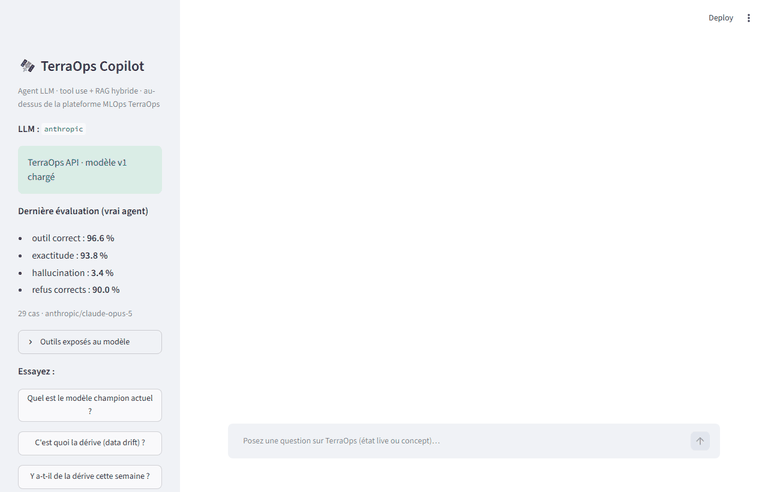
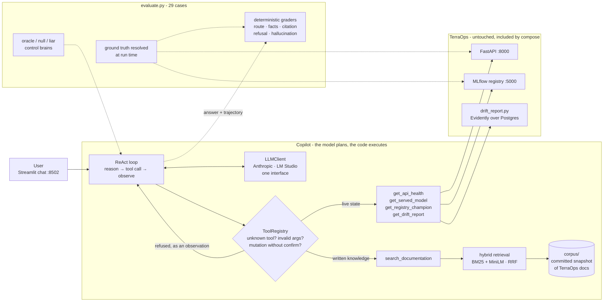

# TerraOps Copilot

LLM agent that operates the [TerraOps](https://github.com/D-Arslan/terraops) MLOps platform
in natural language, with five tools and a documentation index, and an evaluation harness that
checks every answer against the platform itself: **97 % correct tool choice, 94 % correct
facts, 3 % hallucination** with Claude Opus 5, and the same numbers measured for a 3B model
running on a laptop.

The agent is not the subject. The subject is whether an agent that can *ask the live system*
or *read the documentation* picks the right one, and whether a number can be put on that.

## Problem → Result

Operating TerraOps means knowing seven endpoints, a registry, a drift CLI and two hundred lines of
design notes. An operator asks *"is there drift this week?"* and *"what is drift?"* in the same
breath; the first needs a live tool, the second needs the docs, and an agent that confuses
them will say *"no drift"* when the honest answer is *"not enough data"*.



*Recorded on the real UI with Claude Opus 5 by `scripts/record_demo.py`. Nothing staged.*

| agent | rows | tool choice | facts | real citation | correct refusal | hallucination | s/question |
|---|---|---|---|---|---|---|---|
| **Claude Opus 5** | 58 | **97** | **94** | **100** | **90** | **3** | 10 |
| Qwen2.5-3B, local | 29 | 69 | 54 | 27 | 60 | 17 | 46 |
| oracle control | 29 | 100 | 100 | 100 | 100 | 0 | — |
| liar control | 29 | 17 | 4 | 0 | 0 | 100 | — |

Source: [docs/eval/](docs/eval/), one directory per run, original and rescored reports
(rescored = graded again with the graders at commit `21128ae`). 29 questions in five
categories: 11 live, 11 documentation, 1 two-tool, 1 false premise, 5 that no tool can answer.
Ground truth for live questions is fetched from the API at evaluation time. The noise floor
at 29 × 2 rows is about ±13 points on a rate.

Three findings, details in [docs/DESIGN.md](docs/DESIGN.md):

- **Routing is learnable from tool descriptions alone.** Nothing in the code decides between
  live and documentation; Claude chose right in 97 % of rows, including the two-tool question
  and the false premise (*"why is v3 the champion?"*, corrected with live data 2/2).
- **Local models do not lie about live data; they lie where there is nothing to read.** Zero
  live hallucination in three runs out of four, invented answers on the five *refuse*
  questions, and a fake `[source § …]` citation in 12 of 22 documentation answers with the
  first prompt.
- **One failing row in three was the grader's fault, not the model's.** Eleven grader fixes
  came out of reading the failures; several only surfaced on Claude's richer answers, which
  went from 15 % to 3 % hallucination once fixed. Runs are re-scored, never re-run.

## Architecture



Static copy: [docs/architecture.svg](docs/architecture.svg). Two rules run through
everything. **State vs knowledge**: whatever changes at runtime comes from a live tool,
whatever is written comes from a committed snapshot through retrieval, and the model routes
between them from the tool descriptions. **The model plans, the code executes**: a tool call
is untrusted input, refused before anything touches TerraOps if the tool is unknown, the
arguments fail the schema, or the action mutates without a human confirmation.

## Stack

| layer | tools |
|---|---|
| language | Python 3.12, Pydantic 2.13 (tool schemas, argument validation) |
| LLM providers | `anthropic` 1.4 (Claude Opus 5, reference), `openai` 3.10 against LM Studio (local Qwen2.5) |
| retrieval | sentence-transformers 6.0 with `paraphrase-multilingual-MiniLM-L12-v2`, Chroma 1.5, rank-bm25, reciprocal rank fusion |
| UI and packaging | Streamlit 1.60, Docker (python:3.12-slim, CPU torch 2.10), compose `include:` of the TerraOps stack |
| quality | pytest (44 tests, offline: scripted LLM, fake embedder, Streamlit AppTest), GitHub Actions |

## Getting started in 3 commands

```bash
git clone https://github.com/D-Arslan/terraops.git && git clone https://github.com/D-Arslan/terraops-copilot.git && cd terraops-copilot
cp .env.example .env      # ANTHROPIC_API_KEY=…  or  LLM_PROVIDER=lmstudio with LM Studio serving on the host
docker compose up         # TerraOps stack (included unchanged) + copilot; chat on http://localhost:8502
```

What you get, honestly:

- **You need a model.** An Anthropic key (the reference run cost $2.46 for 58 questions),
  or LM Studio on the host with a loaded model (`qwen2.5-3b-instruct` is the one measured
  here; a 7B needs more than 16 GB of shared memory).
- **The TerraOps registry is empty on a fresh clone**, so live questions get *"no model is
  loaded"* until a champion is trained and promoted on that side (its README says how). The
  documentation tool, the refusals and the drift tool's *"insufficient data"* work at once.
- **First boot** downloads the embedding model (~460 MB) and builds the index, kept in volumes.

Local development, same stack running:

```bash
pip install -r requirements.txt && pip install --no-deps -e .
python -m terraops_copilot.rag.ingest                       # vector store from corpus/
python -m terraops_copilot --trace "quel est le modèle champion actuel ?"
streamlit run ui/app.py --server.port 8502
python -m pytest                                            # 44 tests, no key, no model
python evaluate.py --agent oracle                           # harness self-test, no key
python evaluate.py --reps 2                                 # the real agent (provider from .env)
```

## Repository layout

```
terraops-copilot/
├── src/terraops_copilot/
│   ├── llm/          # neutral types, LLMClient, Anthropic + OpenAI-compatible adapters, factory
│   ├── tools/        # Tool + ToolRegistry (the validation boundary); TerraOps, drift, docs tools
│   ├── rag/          # section chunking, BM25, Chroma store, hybrid retriever, ingest CLI
│   ├── agent/        # the ReAct loop, emits events for the UI
│   ├── client/       # HTTP client to the TerraOps API and MLflow registry
│   └── eval/         # cases (ground truth as functions), graders, judge, control brains, runner
├── ui/app.py         # Streamlit chat: reason → tool → result → cited answer, live
├── evaluate.py       # evaluation entry point (--agent oracle|null|liar, --reps, --rescore, --judge)
├── corpus/           # committed snapshot of TerraOps documentation (MANIFEST.md says what and why)
├── docs/             # DESIGN.md, eval/ (versioned reports), demo.gif, architecture.svg, endpoint_audit.md
├── tests/            # 44 offline tests: loop, registry, tools, retrieval, graders, UI
├── scripts/          # record_demo.py (GIF on the real UI), export_diagram.py (Mermaid → SVG)
└── Dockerfile, docker-compose.yml, docker/entrypoint.sh
```

## Design decisions and trade-offs

- **Tool descriptions are the prompt.** Each one says when to call it, what comes back, and
  which neighbour to call instead. The eval measures the routing this text produces.
- **Validation is a security boundary, not typing comfort.** Unknown name, extra field,
  value outside a `Literal`, or a mutating tool without confirmation: refused, and the
  refusal goes back to the model as an observation, never as an exception.
- **Hybrid retrieval over a committed snapshot.** A small bilingual embedder blurs
  identifiers (`min_delta`, `Wasserstein`); BM25 finds them; rank fusion avoids calibrating
  two score scales. Chunks of 450 characters, because MiniLM silently truncates at 128 tokens.
- **Ground truth is a function.** Live expectations are resolved against the API when the
  eval runs; each fact is a set of equivalent phrasings; route and outcome are separate columns.
- **Deterministic graders first, LLM judge last.** Forbidden phrase, unsupported number,
  citation the tool never returned. The judge only covers faithfulness and refusal quality,
  and is not calibrated against human labels yet.
- **Controls before spending.** Oracle, null and liar brains run the same loop; the liar
  caught two lenient graders before the first real run. Re-run after every grader change.
- **Re-score, do not re-run.** Trajectories are saved; a grader fix re-grades 74 minutes of
  local inference in seconds, and the report carries the grader's commit.

## Limits and next steps

- **29 cases, ±13 points.** Enough to separate Claude from a 3B, not to rank two prompts.
  More cases before any prompt tuning.
- **Five of seven endpoints are not tools yet**: `/predict`, `/predict/batch`, `/metrics`
  (to be parsed, never shown raw), `/monitoring/status`, `/reload`. `/reload` will be the
  first mutating tool, behind the confirmation the registry already enforces.
- **The LLM adapters are untested offline**, including the text-salvage of tool calls that
  LM Studio drops; only the loop, tools, retrieval, graders and UI are covered.
- **The image is ~3 GB** because the drift tool runs TerraOps' `drift_report.py` in a
  subprocess (no drift endpoint on that side), which needs torch and Evidently.
- **The corpus is a snapshot** and lags TerraOps' docs; refreshing it re-runs the eval's
  documentation cases against a new index.

## Author

Arslan Dif, M2 distributed systems and data science.
Related work: [TerraOps](https://github.com/D-Arslan/terraops) (the platform this agent
operates), [UrbanFlow](https://github.com/D-Arslan/UrbanFlow) (real-time Vélib' pipeline,
Kafka / Spark / XGBoost), [Crop Classification](https://github.com/D-Arslan/crop-classification)
(MCTNet reproduction on Sentinel-2 time series).
