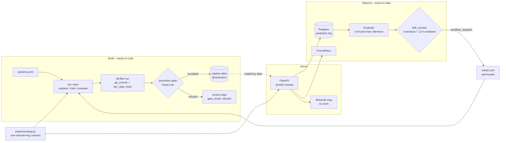

# TerraOps

MLOps platform around a frozen satellite land-use classifier (EuroSAT, ResNet-18,
97.8% test accuracy): reproducible pipeline, governed model registry, serving by
alias, and a drift monitor whose early-warning claim was **measured, not assumed**.

[](https://github.com/D-Arslan/terraops/actions/workflows/ci.yml)

The model is not the subject. The subject is everything that decides whether a
model can still be trusted once it is in production, and being explicit when the
answer is "only partly".

## Problem → Result

Every monitoring stack bets that its drift detector fires *before* the model
breaks. Production has no labels, so the bet is never checked there. Here it can
be: the drift is simulated, the ground truth is kept, and both curves go on one
axis.


| perturbation | detector fires at | accuracy collapses at | lead | verdict |
|---|---|---|---|---|
| cloud veil | 0.1 | 0.2 | +0.1 | early warning |
| seasonal shift | 0.2 | 0.6 | +0.4 | early warning |
| band shift | 0.2 | 0.6 | +0.4 | early warning |
| **blur** | 0.6 | 0.3 | **−0.3** | **late: structural blind spot** |

Source: [experiments/drift_curve/results.json](experiments/drift_curve/results.json)
(500 images of the frozen gate set, 8 intensities, champion v1; "collapse" = 5 points
below the intensity-0 accuracy of 98.6%). Intensity is a fraction of an amplitude the
author chose: only the sign and the ordering *within* a row are meaningful.

Three findings, two of them uncomfortable, all with their caveats in
[docs/DESIGN.md](docs/DESIGN.md):

- **Radiometric drift is caught early.** Cloud, season and sensor calibration are
  flagged at intensity 0.1–0.2 while accuracy is still at 95–98% at 0.4.
- **Blur is a blind spot by construction.** Accuracy falls 97 → 81 → 61% while the
  drifted feature share is still 0.00, then 0.42, under the 0.5 threshold. Eleven of
  the twelve monitored features describe colour. No threshold value gives a positive
  lead; the fix is texture or embedding features, designed and not built.
- **The model becomes confident and wrong.** Under a full cloud veil it is at chance
  level (9.8%) with a mean entropy *below* its resting value. Mean entropy is
  therefore not a trigger here; a class-collapse backstop is.

| the model | value | source |
|---|---|---|
| test accuracy, 4050 images | 97.80% (89 errors) | [metrics/metrics.json](metrics/metrics.json) |
| accuracy on the frozen gate set | 98.10% | `champion_gate_accuracy` in results.json |
| served version | registry v1, alias `@champion`, logged from commit `328d45a` | MLflow registry |

## Architecture



Static copy: [docs/architecture.svg](docs/architecture.svg). Two loops, and the
distinction is the point: CI reacts to a **commit** and produces a tested image; CT
reacts to **drift** and produces a *candidate*, which the gate may refuse.

## Stack

| layer | tools |
|---|---|
| pipeline and data | DVC 3.67, MinIO (S3), `params.yaml` as the single source of truth |
| tracking and registry | MLflow 3.4 on PostgreSQL 16, artifacts proxied to MinIO |
| model | PyTorch 2.10 CPU, torchvision ResNet-18, 64×64 tiles upscaled to 224 |
| serving | FastAPI, Streamlit + folium (thin client, no torch) |
| monitoring | Prometheus 3.13, Evidently 0.7 (normalized Wasserstein), Postgres prediction log |
| quality | pytest (108 tests), ruff, GitHub Actions (CI on hosted runner, CT on self-hosted) |

## Getting started in 3 commands

```bash
git clone https://github.com/D-Arslan/terraops.git && cd terraops && pip install -r requirements.txt
docker compose up -d      # MinIO, Postgres, MLflow :5000, API :8000, UI :8501, Prometheus :9090
dvc repro                 # prepare (downloads EuroSAT, 90 MB) -> train -> evaluate
```

What you get, honestly:

- **After `docker compose up`, the registry is empty**: the API boots in degraded
  mode and answers 503 on `/predict` until a champion exists. That is by design.
- **`dvc pull` does not work from a fresh clone**: the DVC remote is a MinIO on the
  author's machine. The champion weights are not downloadable; they are reproducible.
- **The full `dvc repro` is about 6 CPU-hours** (25 epochs, ~15 min each). For a
  20-minute smoke test, set `train.epochs: 1` in `params.yaml` first, then discard
  the smoke with `git checkout -- params.yaml dvc.lock`.
- **Then promote and serve**, never by moving the alias by hand:

```bash
python src/promote.py --run-id <RUN_ID>    # run id printed by train.py, or from localhost:5000
curl -X POST http://localhost:8000/reload  # the API now serves @champion, no restart
python -m pytest -q -rs                    # 108 tests; 5 non-regression tests skip without the stack
```

Drift chain, all dry-run by default: `src/drift_reference.py` (once, committed) →
`src/drift_traffic.py --kind cloud --intensity 0.6` (tagged traffic) →
`src/drift_report.py --source sim:cloud:0.6` → `src/drift_monitor.py` (`--dispatch`
to actually fire). Copy `.env.example` to `.env` for the host-side variables; Postgres
is published on **55433**, not 5432, on purpose (a native install often owns 5432).

## Repository layout

```
terraops/
├── params.yaml                  # every tunable: pipeline, gate, monitor, simulator
├── dvc.yaml / dvc.lock          # the DAG and its pinned hashes (clean at HEAD)
├── docker-compose.yml           # MinIO, Postgres, MLflow, API, UI, Prometheus (pinned tags)
├── gate/frozen_val.json         # committed anchor for promotion (performance side)
├── monitoring/reference.json    # committed anchor for drift (input side, train split)
├── src/
│   ├── preprocessing.py         # THE train/serving contract (bytes -> tensor)
│   ├── image_features.py        # THE monitoring feature extractor (12 features)
│   ├── train.py / evaluate.py   # pipeline stages, one MLflow run per training
│   ├── promote.py               # champion/challenger gate (pure rules + registry)
│   ├── api.py                   # FastAPI, loads @champion by alias, /reload hot-swap
│   ├── prediction_log.py        # non-blocking Postgres logging (bounded queue)
│   ├── drift_sim.py             # the four label-preserving perturbations
│   ├── drift_report.py          # Evidently comparison + JSON summary
│   ├── drift_experiment.py      # the accuracy vs drift sweep behind the figure
│   └── drift_monitor.py         # CT trigger: persistence, cooldown, dispatch
├── ui/streamlit_app.py          # thin client + folium map
├── tests/                       # unit (preprocessing, features, gate, trigger, API contract) + non-regression
├── experiments/
│   ├── drift_curve/             # results.json + the figure above
│   └── acceptance/              # E2E run of 2026-08-08: summary.json + Evidently reports
├── docs/                        # DESIGN.md (decisions, caveats, debt), learning.md (French log), map.gif
└── .github/workflows/           # ci.yml (ruff, pytest, build, container smoke) · retrain.yml (CT)
```

## Design decisions and trade-offs

- **One preprocessing module** imported by training, the gate and the API, decoding
  included: train/serving skew is impossible by construction, not discouraged by docs.
- **The API loads by alias**, `models:/terraops-eurosat@champion`, never from a path.
  Changing production is a governance action through the gate, then `POST /reload`.
- **A gate that says no**: absolute floor, margin above seed noise, per-class recall
  guard. Over five sprint-2 experiments it refused every challenger; the two real
  refusals (v3, v4) stay in the registry, tagged.
- **Two committed anchors**, never sliding: the frozen gate set and the train-split
  drift reference built without augmentation. A sliding window would hide slow drift.
- **Effect sizes, capped windows, and a status that can say "insufficient data"**:
  a p-value test on a large window fires daily; "no data" must never read as "no drift".

Details, and the reasoning behind each: [docs/DESIGN.md](docs/DESIGN.md).

## Limits and next steps

- **The drift is simulated.** No production stream, no concept drift (perturbations
  are label-preserving), EuroSAT is Eurocentric. The curves are evidence about one
  family of perturbations, not proof.
- **Blur blind spot not fixed.** Next step: texture or frequency features, or drift
  on embeddings.
- **CT cannot run on a hosted runner**: MinIO and MLflow are local, `retrain.yml`
  targets a self-hosted runner. No green badge is claimed for it.
- **`/reload` is manual** (no TTL, no webhook); the served version is visible on
  `/model-info` and in Prometheus, not enforced.
- **Cost**: 64×64 tiles upscaled to 224 (~12× compute), API image 2.53 GB. Next step:
  `mlflow-skinny`, and a native-resolution head.

## Author

Arslan Dif, M2 distributed systems and data science.
Related work: [UrbanFlow](https://github.com/D-Arslan/UrbanFlow) (real-time Vélib'
pipeline, Kafka / Spark / XGBoost), [TerraOps Copilot](https://github.com/D-Arslan/terraops-copilot)
(LLM agent with tools over this stack, evaluated against ground truth),
[Crop Classification](https://github.com/D-Arslan/crop-classification) (MCTNet
reproduction on Sentinel-2 time series).
