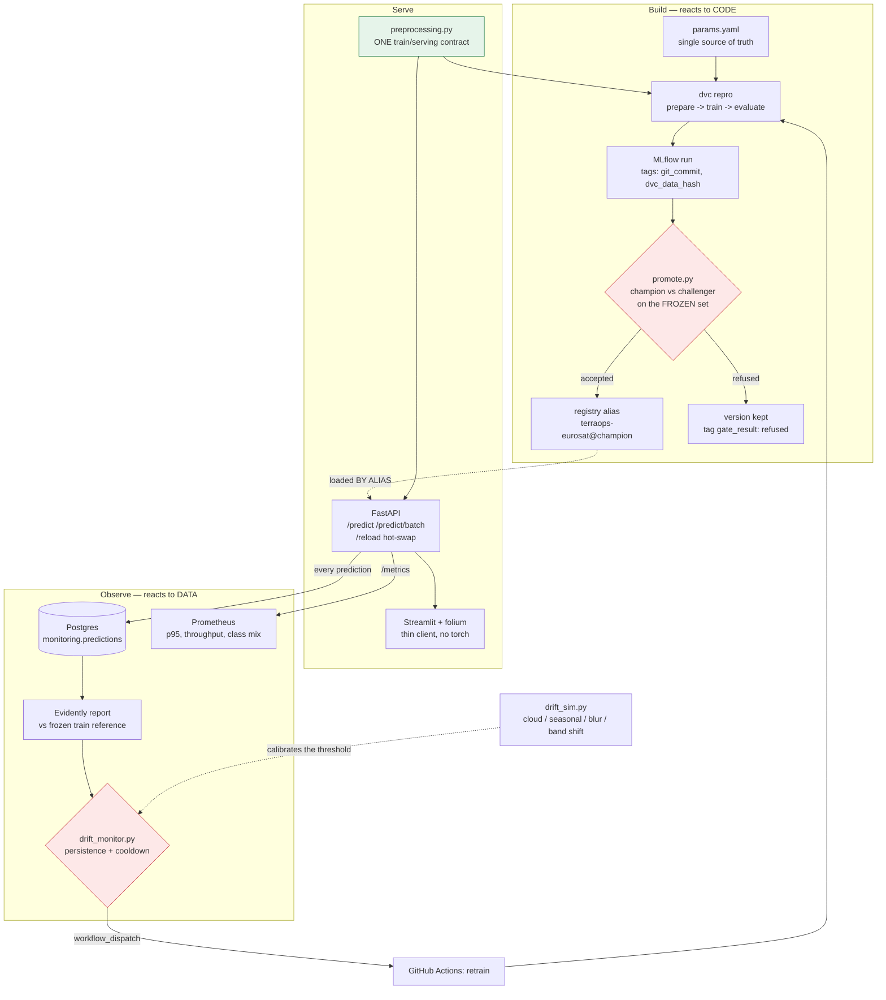

# TerraOps — from a 97.8% research model to a system that knows when it is no longer reliable

TerraOps takes an already-trained satellite land-use classifier (EuroSAT / Sentinel-2,
ResNet-18, **97.8% test accuracy**) and builds the engineering around it: reproducible
pipeline, versioned data, a governed model registry, a serving API, and a monitoring stack
that was **measured rather than assumed**.

> **Design principle.** The model is frozen. TerraOps is not about squeezing out more
> accuracy — it is about everything that decides whether a model can be trusted in
> production, and about being honest when the answer is "partly".

The headline result is not the accuracy. It is this: the drift detector gives an early
warning on three of the four simulated degradations, is **three steps late on the fourth**,
and the model becomes **more confident as it becomes catastrophically wrong**. All three
facts are measured, reproducible, and documented below — including the ones that are
inconvenient.

---

## Architecture



Two loops, and the distinction is the point of the whole project:

| | trigger | input | output | decided by |
|---|---|---|---|---|
| **CI/CD** | a commit | code | tested image | tests (deterministic) |
| **CT** | **drift in the data** | data + frozen code | a **candidate** model | the promotion gate |

A model decays with no code change. CI has no reason to fire when nobody commits — which
is exactly why CT exists, and why its output is a candidate rather than a deployment.

---

## The map


Twenty tiles (two per class) dropped in at once, one `/predict/batch` call, and a
class per cell with its confidence on hover. The sidebar shows what is answering:
`Champion v1`, resolved from `terraops-eurosat@champion` — the API never loads a
`.pth` path, so changing the production model is a registry action, not a deploy.

The UI is a **thin client**: it holds no model and its image has no torch (784 MB vs the
API's 2.53 GB). It calls `/predict/batch` and renders the answers on a folium map.

---

## What was measured (Sprint 4)

The question every monitoring stack bets on and almost none verifies: **does the drift
detector fire before the model breaks?** Production has no labels, so the bet cannot be
checked there. Here it can, because the drift is simulated and the ground truth is kept.

`src/drift_experiment.py` sweeps four perturbations × eight intensities over 500 images of
the frozen gate set, and plots both curves on one axis.


| perturbation | detector fires at | accuracy collapses at | lead | verdict |
|---|---|---|---|---|
| cloud veil | 0.1 | 0.2 | **+0.1** | early warning |
| seasonal shift | 0.2 | 0.6 | **+0.4** | early warning |
| band shift | 0.2 | 0.6 | **+0.4** | early warning |
| **blur** | 0.6 | 0.3 | **−0.3** | **late — blind spot** |
| all combined | 0.2 | 0.1 | **−0.1** | late (inherits blur) |

Baseline at intensity 0: **98.60%** on the 500-image sample (the champion was gated at
98.10% on the full 4050 — consistent within sampling noise, so the baseline is auditable,
not self-declared).

### Three findings

**1. Radiometric drift is caught early.** For seasonal and sensor-calibration shifts, drift
is flagged at intensity 0.2 while accuracy still holds at 96–98% up to 0.4. The detector
buys real time.

**2. Blur is a structural blind spot.** Accuracy falls 97% → 81% → 61% while the drifted
feature share stays at exactly **0.00**. Eleven of the twelve monitored features describe
colour; one describes texture. A perturbation that moves a single feature can never reach
a *share*-of-features threshold of 0.5. **No value of that threshold fixes this** — it is a
design consequence, now measured rather than suspected.

**3. The model becomes confident and wrong.** Under a full cloud veil:

| intensity | 0.0 | 0.4 | 0.6 | 0.8 | 1.0 |
|---|---|---|---|---|---|
| accuracy | 0.986 | 0.550 | 0.216 | 0.118 | **0.098** |
| mean entropy | 0.021 | 0.116 | 0.145 | 0.030 | **0.008** |
| majority class share | 0.12 | 0.40 | 0.71 | 0.97 | **1.00** |

At intensity 1.0 the model is at **chance level** (9.8% over ten classes) and **more
certain than at rest**. Entropy rises through the confusion zone and then *falls back below
baseline* as every input collapses onto one class.

**Consequence, applied:** mean prediction entropy is **not** a CT trigger in this project.
A "confidence is low → something is wrong" alert would report green at the worst possible
moment. The class-collapse signal is kept instead — as a *catastrophe backstop*, not an
early warning, because it too only reaches its threshold under blur once accuracy is
already at 27%.

---

### End-to-end acceptance test

520 real HTTP requests through the containerized API (`src/drift_traffic.py`),
0 failures. Both runs use the **same balanced sampling** over the ten classes, so
the two rows differ only by the perturbation:

| traffic | n | server p95 | mean confidence | mean entropy | classes predicted | majority class | drift verdict |
|---|---|---|---|---|---|---|---|
| `v2:baseline` | 260 | 851 ms | 0.987 | 0.019 | **10/10** | 0.12 | **no drift** (share 0.00) |
| `v2:cloud:0.6` | 260 | 1098 ms | 0.861 | 0.156 | **7/10** | `SeaLake` **0.63** | **DRIFT** (share 0.92, top `mean_b` 1.44) |

The CT monitor then went `streak 1/3 → 2/3 → 3/3 → would dispatch` with both
detectors lit, and switching back to the baseline source **reset the streak to 0**.

Because the input sampling is identical across the two rows, the class collapse is
attributable to the model rather than to the traffic — which is the only way that
number means anything. It did not start out that way: see the sampling bug in
`learning.md`, where a first version of this table reported a collapse that was
partly an artefact of which tiles were sent.

Honesty note on the latencies: client-side p95 was ~1000–1300 ms against 851 ms
server-side — the gap is PNG encoding, HTTP and the Python client. Both server
values are well above the 400 ms single-image budget in `params.yaml:nonreg`, but
they measure different things: that budget covers a forward pass in process, while
these cover decode + features + logging under a saturating single-client load on a
dev laptop. Not a regression; not a number to quote as production latency either.

---

## Technical decisions, and why

**One preprocessing module, imported by training, the gate and the API.**
`src/preprocessing.py` owns the whole chain from raw bytes to tensor — decoding included,
because channel order, alpha, and EXIF rotation are the classic silent-skew sources and
they happen *before* the transforms. Train/serving skew is impossible by construction
rather than discouraged by documentation.

**The API loads the model by ALIAS, never from a path.**
`models:/terraops-eurosat@champion`. Changing what production serves is a governance action
(move the alias through the gate), not a code deploy. `POST /reload` re-resolves the alias
in process, so a promotion reaches production without a restart.

**A promotion gate that can say no.**
Absolute accuracy floor, a minimum delta above seed noise, **and a per-class recall
guard**: a challenger that gains 0.5 points overall while losing 8 on `Highway` is refused.
Over the sprint-2 campaign, 5 experiments produced 0 improvements and **3 documented
refusals**. A gateless CT loop would have shipped all three.

**A frozen validation set, committed.**
`gate/frozen_val.json` is the anchor every version is measured against. Its input-side twin
is `monitoring/reference.json` — the drift reference, built from the **train** split,
**without augmentation** (augmentation is a regulariser, not a description of the world;
including it would inflate the reference variance and blind the detector to exactly the
radiometric drift it exists to catch).

**Effect sizes, not p-values.**
The drift test is pinned to normalized Wasserstein distance in `params.yaml`. A p-value
test answers "am I sure they differ?", and at large volume the answer is always yes: at
n = 500k, KS rejects on a 0.2% CDF difference — significant and irrelevant, fires daily
until someone mutes it. The window is capped for the same reason, and a floor makes the
report **refuse to conclude** on thin traffic rather than emit a confident verdict.

**Three-valued drift status.** `ok / drift` / `insufficient_data`. "No data" must never
read as "no drift" — that is the silent-failure shape this whole sprint exists to prevent.

**Non-blocking prediction logging.** Every prediction is written to Postgres through a
bounded queue drained by a background thread. If the queue saturates, rows are **dropped
and counted**, and the counter is exposed. A monitoring pipeline must never be able to take
down the service it observes; losing rows silently would be worse, because a drift report
computed over a lossy window is wrong without saying so.

**Prometheus and Postgres do different jobs.** Prometheus answers "is the service healthy
now?" (pre-aggregated, seconds, days of retention). Postgres answers "what exactly did
production see?" (row-level, joinable, months). Doing drift detection in Prometheus would
mean per-image feature values as labels — unbounded cardinality, the canonical way to kill
a Prometheus server.

**A CT loop that mostly refuses.** Persistence (3 consecutive windows), a 12-hour cooldown,
inconclusive windows that neither confirm nor reset, and an explicit `--dispatch` flag
(dry run by default). Drift caused by a broken sensor does not go away when you retrain, so
without a cooldown the loop would retrain forever on increasingly corrupted data.

---

## LIMITS AND PROTOCOL HONESTY

Everything above is real and reproducible. Here is exactly what it does **not** establish.

**The drift is simulated. There is no production stream.**
No second satellite, no seasonal archive, no user feedback. The perturbations are
parametric functions I wrote, with amplitudes I chose (`params.yaml: drift_sim`). A
detector calibrated on that family is calibrated on **that family**. Real drift — a new
sensor's spectral response, a different atmospheric correction, a new geography — can be
shaped differently. The curves are evidence, not proof, and the threshold they produce is a
starting point, not a guarantee.

**Only covariate shift is simulated, never concept drift.**
The perturbations are label-preserving by construction: a forest under haze is still a
forest, so `P(Y|X)` is untouched. Simulating concept drift would mean changing the labels,
which is a different experiment. **Nothing here demonstrates detection of concept drift, and
concept drift is not detectable without labels at all.**

**The intensity axis is arbitrary.** `0.4` is not "40% cloud cover"; it is 40% of an
amplitude I picked. Comparing leads *between* perturbations compares different arbitrary
scales. Only the **sign** and the **ordering** of the two events within one perturbation are
meaningful.

**The lead values are grid bounds, not crossing points.** Measured on
`[0, 0.1, 0.2, 0.3, 0.4, 0.6, 0.8, 1.0]`, so a reported lead of +0.1 is compatible with a
true lead near zero. The grid is also denser at the low end, so leads measured high in the
range are coarser. A lead of 0 does not prove simultaneity.

**The accuracy numbers carry ±2 points of sampling noise.** The sweep uses 500 images. That
is why "collapse" is defined as a 5-point drop, comfortably above the noise — but small
differences between adjacent points should not be read as signal.

**EuroSAT is Eurocentric, and small.** 27,000 Sentinel-2 tiles over Europe, 64×64 pixels,
ten coarse classes, cloud-free by curation. Nothing here says anything about tropical
land cover, arid regions, sub-metre imagery, or the cloudy scenes that dominate real
acquisition. The 97.8% is a number about *this* benchmark.

**The tiles are natively 64×64 and are upscaled to 224.** Roughly 12× the compute for no
extra information — inherited from the ImageNet backbone. Known debt, deliberately not
changed mid-campaign so comparisons stay valid.

**The monitoring blind spot is real and not fixed.** Under blur, neither detector warns in
time. The honest summary is: this stack catches radiometric drift early and misses
texture-only degradation. Fixing it would mean adding texture/frequency features or
embedding-based drift — designed, not yet built.

**Two real drifts can cancel on a monitored feature.** Measured while building the
simulator: the cloud veil brightens while the winter shift darkens, so their composite is
*closer* to the reference in aggregate pixel distance than the cloud alone; and the band
shift's asymmetric gains raise saturation, cancelling the drop from cloud and winter. A
single aggregate distance can shrink while the situation worsens. Feature-level comparison
mitigates this; it does not eliminate it.

**The CT workflow cannot run on a GitHub-hosted runner.** It needs the DVC remote (MinIO)
and the MLflow registry, both of which run locally. `retrain.yml` targets a self-hosted
runner. On a public runner it will not work — no green badge is claimed for it.

**The API's own drift is not monitored.** `/reload` is manual: no TTL, no webhook. If a new
champion is promoted and nobody calls it, the API keeps serving the old version. The
version is exposed on `/model-info` and as a Prometheus label, so it is *visible*, but
nothing enforces it.

**The 97.8% is inherited, not reproduced end to end here.** Sprint 1 reproduced the
reference model bit-for-bit from the pipeline; the number's original provenance is the
audited notebook that preceded this repository.

---

## Getting Started

### Prerequisites
Python 3.12, Docker.

### 1. Install and start the stack
```bash
git clone https://github.com/D-Arslan/terraops.git && cd terraops
pip install -r requirements.txt
docker compose up -d          # MinIO, Postgres, MLflow, API, UI, Prometheus
```
Never `docker compose down -v` — it destroys the run history and the registry.

| service | URL |
|---|---|
| MLflow (tracking + registry) | http://localhost:5000 |
| Serving API (Swagger at `/docs`) | http://localhost:8000 |
| Streamlit map | http://localhost:8501 |
| Prometheus | http://localhost:9090 |
| MinIO console | http://localhost:9001 |
| Postgres (host access for the monitoring CLI) | `localhost:55433` |

Postgres is published on **55433**, not 5432: a native PostgreSQL install commonly
owns 5432, and the container would appear to publish the port while every host
connection silently reached the other database.

### 2. Reproduce the pipeline
```bash
dvc pull      # fetch dataset + model from the remote, OR
dvc repro     # rebuild: prepare -> train -> evaluate
```

### 3. Promote a model (never move the alias by hand)
```bash
python src/promote.py --run-id <RUN_ID>     # exits 1 if the gate refuses
curl -X POST http://localhost:8000/reload   # serve the new champion, no restart
```

### 4. Monitoring
```bash
python src/drift_reference.py                    # build the frozen reference (once)
python src/drift_report.py --source ui           # Evidently HTML + JSON summary
python src/drift_monitor.py                      # CT decision (dry run by default)
python src/drift_monitor.py --dispatch           # actually trigger retraining
python src/drift_experiment.py --sample 500      # the accuracy/drift curve (~35 min CPU)
```

### 5. Tests
```bash
pytest -q -rs    # non-regression tests auto-skip if the stack is down
ruff check src tests
```

---

## Project structure

```
terraops/
├── params.yaml                  # every tunable: pipeline, gate, monitor, simulator
├── dvc.yaml / dvc.lock          # the DAG and its pinned hashes
├── docker-compose.yml           # MinIO, Postgres, MLflow, API, UI, Prometheus
├── gate/frozen_val.json         # committed anchor for promotion (performance side)
├── monitoring/
│   ├── reference.json           # committed anchor for drift (input side)
│   ├── prometheus.yml           # scrape config
│   └── rules.yml                # service + model-signal alerts
├── src/
│   ├── preprocessing.py         # THE train/serving contract
│   ├── train.py / evaluate.py   # pipeline stages
│   ├── promote.py               # champion/challenger gate
│   ├── api.py                   # FastAPI, loads @champion by alias
│   ├── image_features.py        # THE monitoring feature extractor
│   ├── prediction_log.py        # non-blocking Postgres logging
│   ├── metrics.py               # Prometheus instrumentation
│   ├── drift_sim.py             # the four perturbations
│   ├── drift_reference.py       # frozen train reference
│   ├── drift_report.py          # Evidently comparison + JSON summary
│   ├── drift_experiment.py      # the accuracy vs drift sweep
│   ├── drift_monitor.py         # CT trigger: persistence, cooldown, dispatch
│   └── resolve_run.py           # run lookup by git_commit, for the CT workflow
├── ui/streamlit_app.py          # thin client + folium map
├── experiments/drift_curve/     # results.json + the figure above
├── .github/workflows/
│   ├── ci.yml                   # ruff, pytest, docker build, container smoke test
│   └── retrain.yml              # CT: workflow_dispatch -> dvc repro -> gate
└── learning.md                  # the learning log (French): concepts, mistakes, interview prep
```

---

## Tech stack

`PyTorch` · `DVC` · `MinIO` · `MLflow` · `FastAPI` · `Streamlit` · `Postgres` ·
`Prometheus` · `Evidently` · `Docker` · `GitHub Actions` · `ruff` · `pytest`
